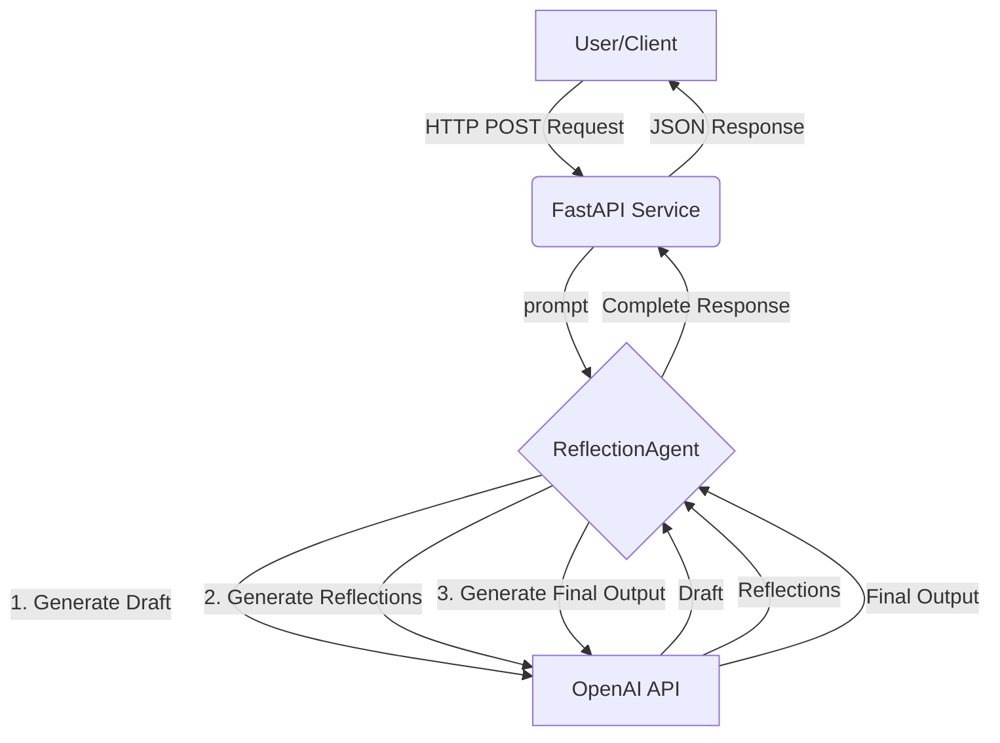

# Reflection Agent Service 🤖✨

[](https://github.com/PRYSKAS/REFLECTION_PATTERN_AGENT/actions)

This project is an AI microservice built around the **Reflection agent design pattern** to iteratively analyze, critique, and refine Large Language Model (LLM) outputs. It showcases the end-to-end engineering process of transforming a core AI script into a robust, containerized, and production-ready service.

## 🧠 Core Concept: The Reflection Pattern

The Reflection Pattern enhances the quality and reliability of LLM outputs through a structured, three-step self-critique process:

1.  **Generate:** The agent produces an initial draft in response to a prompt.
2.  **Reflect:** The agent analyzes its own draft, identifies flaws or areas for improvement, and generates a list of actionable, constructive critiques.
3.  **Refine:** The agent re-attempts the original task, this time using its own critiques as a guide to generate a superior final output.

This cycle mimics the human process of drafting and revision, leading to responses that are more coherent, accurate, and aligned with the user's intent.

## 🚀 Engineering & MLOps Highlights

This project emphasizes the engineering required to serve an AI model reliably and scalably.

* **Microservice API:** The agent's logic is exposed via a RESTful API using **FastAPI**, with clear data contracts enforced by **Pydantic** for robust I/O validation.
* **Containerization:** The entire application is containerized with **Docker**, ensuring a consistent execution environment and simplifying deployment across any platform.
* **Unit Testing:** The agent's core business logic is rigorously tested using **Pytest** and **pytest-mock**, guaranteeing the reliability and integrity of each component.
* **Automated CI/CD:** A **GitHub Actions** pipeline is triggered on every push to `main`, automatically performing:
    * **Linting** with **Ruff** to enforce code quality and style consistency.
    * **Unit Testing** to prevent regressions and ensure code health.
* **Secrets Management:** API keys and sensitive credentials are handled securely using `.env` files for local development and **GitHub Actions Secrets** in the CI/CD pipeline, preventing any exposure in the repository.

## 🏗️ Service Architecture



## 🏁 Getting Started

### Prerequisites
* Git
* Python 3.9+
* Docker Desktop (running)

### 1. Running Locally (for Development)

1.  **Clone the repository:**
    ```bash
    git clone [https://github.com/PRYSKAS/REFLECTION_PATTERN_AGENT.git](https://github.com/PRYSKAS/REFLECTION_PATTERN_AGENT.git)
    cd REFLECTION_PATTERN_AGENT
    ```

2.  **Set up the environment:**
    * Create a `.env` file from the example: `copy .env.example .env` (on Windows) or `cp .env.example .env` (on Unix/macOS).
    * Add your `OPENAI_API_KEY` to the new `.env` file.

3.  **Install dependencies:**
    ```bash
    pip install -r requirements.txt
    pip install -e .
    ```

4.  **Run tests to verify the setup:**
    ```bash
    pytest
    ```

5.  **Start the API server:**
    ```bash
    uvicorn main:app --reload --port 8001
    ```
    The API will be available at `http://127.0.0.1:8001/docs`.

### 2. Running with Docker (Production Mode)

This is the recommended way to run the service for a stable, isolated deployment.

1.  **Build the Docker image:**
    ```bash
    docker build -t reflection-agent-service .
    ```

2.  **Run the container:**
    ```bash
    docker run -d -p 8001:8001 --env-file .env --name reflection-agent reflection-agent-service
    ```
    The service will now be running in the background. Access the API documentation at `http://127.0.0.1:8001/docs`.

## 📡 API Endpoint

### `POST /run`

Executes the agent's full generate-reflect-generate cycle.

**Request Body:**
```json
{
  "prompt": "Write a tweet about the importance of CI/CD in AI engineering."
}
```

**Success Response (200 OK):**
```json
{
  "initial_draft": "CI/CD is crucial in AI engineering. #AI #MLOps",
  "reflections": [
    "- The tweet is too short and generic.",
    "- It could add a specific benefit, like 'accelerating value delivery'.",
    "- An emoji would increase engagement."
  ],
  "final_output": "🚀 CI/CD in AI Engineering isn't a luxury; it's a necessity! It accelerates value delivery by automating testing and deployment, ensuring robust models reach production faster. #MLOps #AIEngineering"
}
```